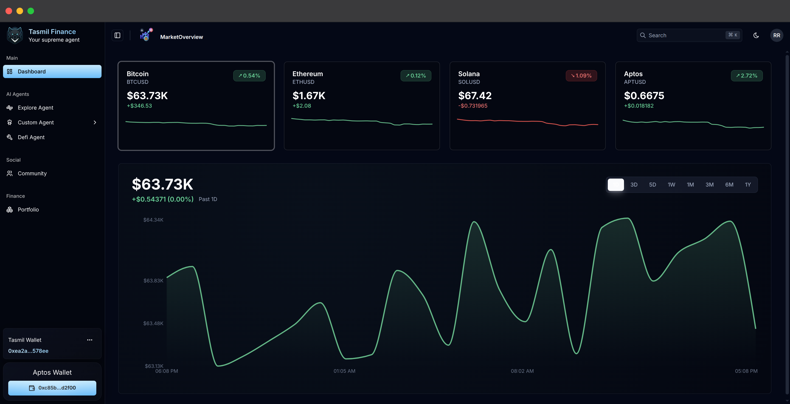

## Project Background

Tasmil Finance was originally developed as a team project during Aptos Vietnam Hackathon 2025 and VietBUIDL Hackathon 2025.

The official competition submission and deployed version remain private within the team.

This repository was created to showcase and document the features and components that I personally contributed during the hackathon, including backend services, data processing, API integrations, and dashboard functionality.

# Tasmil Finance

A production-grade, highly optimized Web3 DeFi Portfolio Management & Market Analytics Dashboard built on the **Aptos Blockchain** and powered by a high-throughput **NestJS/Next.js monorepo** architecture.

Tasmil Finance delivers real-time market indexing, advanced charting analysis, secure hot wallet creation, and conversational natural-language trading execution via custom AI intent parsers.

---

## Project Description

Tasmil Finance is a sophisticated, full-stack decentralized finance (DeFi) dashboard designed to solve the complexity of managing multi-protocol assets and analyzing real-time financial indices in the Web3 space.

### The Problem it Solves
DeFi interactions suffer from highly fragmented user interfaces, complicated execution flows, and disjointed analytics. Users are forced to bounce between charting platforms, explorer databases, and transaction routers just to audit their holdings and execute simple swaps. Furthermore, tracking market sentiment or trading trends while staying within compliance rates of equity/crypto API endpoints adds massive infrastructure overhead.

### What the Platform Does
Tasmil Finance bridges these gaps by combining:
1. **Intelligent Aggregation**: Unified market quotes and historical charts for equities and major crypto indexes.
2. **Web3 Hot Wallets**: Automated creation, local AES symmetric encryption, and Supabase Vault storage of Aptos-based hot wallets for instant transactions.
3. **Conversational Agent Execution**: An integrated AI-powered console (Vercel AI SDK) that interprets user intent (e.g., swapping tokens, staking, checks) and compiles them into ready-to-execute smart contracts.
4. **Resilient High-Availability Cache**: A rate-limiting Redis buffer guarding upstream data vendors (like Financial Modeling Prep) to ensure sub-10ms response times for clients under high traffic.

### Why it was Built
Built to demonstrate modern full-stack systems engineering, Tasmil Finance showcases best practices in **modular NestJS services**, **Next.js 15 Server Components**, and **state-of-the-fly cryptographic execution** on the Aptos network.

---

## Screenshot Section

Below are visual previews of the Tasmil Finance interface:

<!-- Dashboard Screenshot -->
<div align="center">
  
  <p><i> Main Dashboard Overview showing real-time token quotes and price metrics.</i></p>
</div>


---

## Features

* **Portfolio Tracking**: Real-time aggregation of multi-wallet balances, historical return calculations, and asset allocation breakdown on the Aptos Mainnet.
* **Market Analytics**: Ticker price quotes, 24h highs/lows, trading volume, average prices, and change percentages.
* **Asset Performance Charts**: Responsive, gradient-filled area charts (Recharts) with local interactive tooltips that dynamically switch themes based on 1D, 3D, 5D, 1W, 1M, 3M, 6M, and 1Y timeframes.
* **Wallet Connection**: Petra, Martian, Pontem, and OKX adapters enabling one-click login and secure message signing.
* **Historical Market Data**: Direct integration with the FMP endpoint, structured via a custom API rate-limiting queue to guarantee uptime and prevent 429 errors.
* **Backend API Layer**: Clean NestJS service architecture utilizing global throttlers, cookie-parsers, and route prefixing.
* **Redis Caching**: Multi-tier Redis storage cache with dynamic TTL configurations (from 30s for quote tickers to 30 mins for historical charts) to minimize third-party API dependencies.

---

## Architecture

The system uses a decoupled client-server architecture. The Next.js frontend acts as the user gateway, utilizing Serverless API Route Proxies to talk securely to the NestJS backend.

### Architecture Diagram

```
       ┌────────────────────────────────────────────────────────┐
       │                      Aptos Wallet                      │
       └────────────────────────────────────────────────────────┘
                                   │
                      Secure Sign  │  (Ed25519 Message Signature)
                                   ▼
       ┌────────────────────────────────────────────────────────┐
       │                    Next.js Frontend                    │
       │           (React 19 / Tailwind / Recharts)             │
       └────────────────────────────────────────────────────────┘
                                   │
                    Proxy REST     │  (Cookie-based JWT Authorization)
                    Requests       ▼
       ┌────────────────────────────────────────────────────────┐
       │                    NestJS Backend                      │
       │              (App Throttler & Validation)              │
       └────────────────────────────────────────────────────────┘
                    │                              │
         Saves/Loads│                              │ Checks cache
         Encrypted  ▼                              ▼
    ┌───────────────┐                    ┌──────────────────┐
    │  PostgreSQL   │                    │   Redis Cache    │
    │(Supabase Vault│                    │(Distributed Store│
    │   via RPC)    │                    │   Keyv Manager)  │
    └───────────────┘                    └──────────────────┘
                                                   │
                                     [Cache Miss]  │ Fetch fresh data
                                                   ▼
                                         ┌──────────────────┐
                                         │  External APIs   │
                                         │   (FMP Engine)   │
                                         └──────────────────┘
```

---

## Tech Stack

### Frontend
* **Next.js (v15 canary)**: Utilizing App Router, React Server Components (RSCs), Middleware guards, and Partial Prerendering (PPR).
* **React (v19 RC)**: For stateful UI rendering and asynchronous hook executions.
* **TypeScript**: Strict type systems for self-documenting code.
* **Tailwind CSS (v4)**: Modern, performance-focused utility styling.
* **Recharts (v2.15)**: Custom tooltips and gradients for high-fidelity charting.

### Backend
* **NestJS (v11)**: Core enterprise framework using Dependency Injection (DI) and modular architectures.
* **PostgreSQL (via Supabase)**: Vault secret table storage, isolating private key credentials via database RPC functions (`insert_secret`, `read_secret`).
* **Redis**: Distributed key-value caching layer integrating `@nestjs/cache-manager` and `@keyv/redis`.

### Infrastructure
* **Docker / Docker Compose**: Multi-container service virtualization and environment provisioning.
* **PM2**: Multi-core process clustering, memory ceiling monitoring, and zero-downtime hot reloads.

---

## Monorepo Structure

```text
tasmil-finance/
├── client/              # Next.js frontend application
├── server/              # NestJS backend API service
├── screenshots/         # Local folder containing application screenshots
├── docker-compose.yml   # Docker multi-container orchestration configuration
└── README.md            # Root-level project documentation
```

* **`client/`**: Houses the frontend visual views, layouts, custom hooks, and Zustand wallet state stores. It includes serverless routes proxying requests to the backend, and local Drizzle ORM queries for tracking database metadata.
* **`server/`**: Contains the core NestJS backend, structured into feature-based submodules (`Auth`, `Accounts`, `Dashboard`, `Redis`, `Supabase`). It contains database RPC services and FMP rate-limiting queue handlers.
* **`screenshots/`**: Stores visual screenshot assets referenced locally inside this root documentation directory.
* **`docker-compose.yml`**: Defines runtime containers, mapping ports and networks to connect the Next.js frontend, NestJS backend, and a Redis cache instance seamlessly.

---

## Quick Start

Follow these steps to spin up the entire application stack locally using Docker Compose:

### 1. Clone the Repository
```bash
git clone https://github.com/your-username/tasmil-finance.git
cd tasmil-finance
```

### 2. Set Up Environment Variables
Create `.env` files in both the `client/` and `server/` directories:
```bash
# Server configuration
cp server/.env.example server/.env

# Client configuration
cp client/.env.example client/.env.local
```
Configure your environment secrets (`FMP_KEY`, `SUPABASE_URL`, `SUPABASE_ROLE_KEY`, `JWT_SECRET`, `PASSWORD_ENCRYPT`) inside these files.

### 3. Run Docker Compose
Compile and launch all containers (NestJS Server, Next.js Client, Redis Cache) in detached mode:
```bash
docker compose up -d --build
```

### 4. Access the Frontend
Open your browser and navigate to `http://localhost:3000` to view the dashboard.

### 5. Access the Backend
The backend REST endpoints are hosted at `http://localhost:5000/api`. You can view the live Swagger documentation at `http://localhost:5000/api/docs`.

---

## System Design

Tasmil Finance is built with a focus on security, low latency, and rate-limiting resilience:

```
[Request Quote] ──► SWR Fetch ──► Next.js Proxy ──► NestJS Guard ──► Check Redis
                                                                           │
                                 [Cache Hit] ◄─── (Sub-10ms Response) ◄────┼─── [Yes]
                                                                           │
                                 [Cache Miss] ◄── FMP Queue (Rate Limit) ◄─┴─── [No]
```

* **Data Flow**: SWR triggers client-side data fetches targeting Next.js proxy routes. The proxy forwards the requests to the NestJS API with the HTTP-only cookie. NestJS intercepts, validates, and either serves the data from Redis (on cache hits) or fetches it from external sources.
* **Market Data Fetching**: Built with a throttling request queue in `FmpApiService`. The queue schedules outgoing fetches within FMP's limit of 250 requests/minute and uses exponential backoff to handle network drops.
* **Cache Layer**: Handled by `@nestjs/cache-manager` linked to Upstash/Redis. It caches real-time metrics with custom TTLs:
  - Quotes: 30 seconds
  - 1D Charting: 5 minutes
  - 1M+ Charting: 30 minutes
* **Database Layer**: Leverages PostgreSQL inside Supabase. Instead of traditional ORM tables, it uses database RPC SQL procedures (`insert_secret`, `read_secret`) to store and retrieve encrypted hot wallets securely.

---

## My Contribution

This repository represents the features and components that I personally developed after the Aptos Vietnam Hackathon 2025.

My work focused on:

- Building a NestJS backend that aggregates market and portfolio data from third-party APIs.
- Designing REST APIs consumed by the frontend dashboard.
- Implementing Redis caching for market data retrieval.
- Developing dashboard pages and data visualizations using Next.js and Recharts.
- Integrating Aptos Wallet Adapter for wallet connectivity.
- Containerizing the application using Docker for local development and deployment.
- Writing project documentation and deployment guides.

The original hackathon submission was developed collaboratively by a team of 4 members and remains private. This repository is a personal continuation created for learning, experimentation, and technical exploration.

## Future Improvements

* **Decentralized Execution**: Migrate the current hot-wallet execution architecture to use secure gasless transaction relayers on the Aptos network.
* **Real-time Price Streams**: Replace the HTTP polling mechanism with WebSockets using the Pyth Network or FMP streaming engines.
* **Multi-Chain Asset Aggregation**: Expand portfolio tracking support to other L1 and L2 networks like Ethereum, Solana, and Sui.
* **Advanced AI Intents**: Train and fine-tune a local LLM agent to interpret complex DeFi strategies, such as automated yield farming and automated liquidity provision.

---

## License

This project is licensed under the MIT License - see the [LICENSE](LICENSE) file for details.
